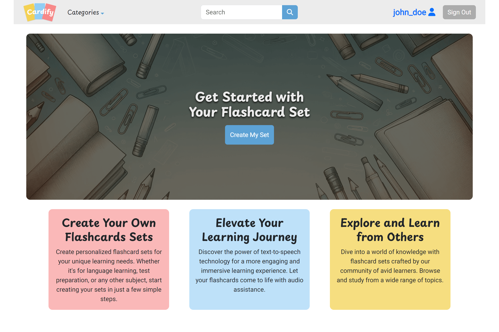

# Cardify

Cardify is an intuitive and user-friendly platform that allows users to create, edit, and manage flashcards. Whether you're a student, professional, or just someone eager to learn, our application is designed to cater to all your flashcard needs. This application aids users in creating flashcard sets for effective and efficient learning. Users can flip the flashcards, edit them, organize them into categories, and utilize the text-to-speech feature, enhancing accessibility to learning.

- [Live Demo](https://cardify-sable.vercel.app/)[^1]

[^1]: The Vercel Postgres database may experience cold starts when inactive. Occasionally, this could lead to a 500 Internal Service Error. A simple page refresh should resolve the issue.

## Enhancements

Further building upon the project presented during the final demo and after graduating from Lighthouse Labs Bootcamp, I have introduced several enhancements to the project we developed. These include setting up routes for user registration and login, integrating user session cookies, bug fixes, enhancing responsive design, adding notifications and error messages for an improved user experience, and refactoring code for better clarity and reusability. Furthermore, I have hosted the project on Vercel with Vercel Postgres.

## Screenshots

<u>Desktop Design</u> <br/>
Landing Page


Create Set Page


View Set Page


Search Page


Profile Page (My Sets tab)


<u>Mobile Design</u> <br/>

<table>
  <tr>
    <td>Landing Page</td>
     <td>Create Set Page</td>
  </tr>
  <tr>
    <td></td>
    <td></td>
  </tr>
     <td>View Set Page</td>
     <td>Profile Page (Favorites tab)</td>
  </tr>
  <tr>
    <td></td>
    <td></td>
  
  </tr>
 </table>

## Target Audience

1. Students
2. Educators
3. Professionals
4. Lifelong learners

## Features

- Create flashcard sets with text.
- Abiliy to mark sets as public or private.
- Edit flashcards anytime, either through the edit set page or by making direct changes to the cards on the view page.
- Flip flashcards to view the front and back.
- Organize flashcards into categories.
- Use text-to-speech for better auditory learning.
- Logged-in users can mark favorite sets for quick access.
- Register and login functionalities for secure user access.

## Getting Started

Install dependencies with `npm install` in each respective `/client` and `/server`.

### [Frontend] Running Development Server

```sh
cd client
npm run dev
```

### [Backend] Running Backend Server

Read `server/readme` for further setup details.

```sh
cd server
npm start
```

## Dependencies

### Frontend

- React
- React-Bootstrap
- React-Router
- React-Toastify
- React-Confetti
- SASS
- Fontawesome
- Axios

### Backend

- Node.js
- Express.js
- PostgreSQL
- Bcrypt
- Cookie-session
- Dotenv

### Deployment

- Vercel
- Vercel Postgres

# Team

- [Rita Tang](https://github.com/ritatanght)
- [Ralph D'Couto](https://github.com/ironmaiden59)
- [Justin Hao](https://github.com/jhaoY)
