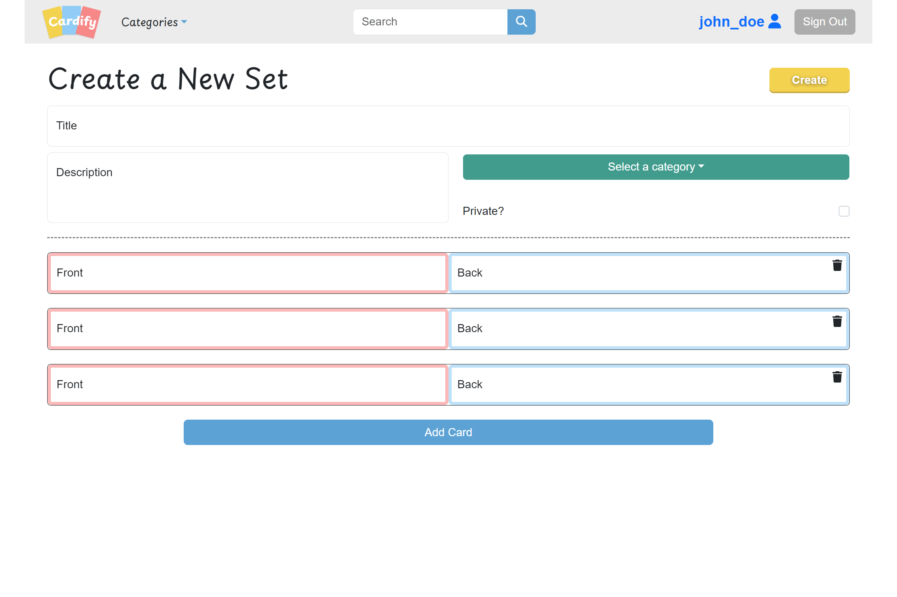

# Cardify

Cardify is an intuitive and user-friendly platform that allows users to create, edit, and manage flashcards. Whether you're a student, professional, or just someone eager to learn, our application is designed to cater to all your flashcard needs. This application aids users in creating flashcards for effective and efficient learning. Users can flip the flashcards, edit them, organize them into categories, and save them as a set. There's also a text-to-speech feature, making learning even more accessible.

## Screenshots
Landing Page


Create Set Page


View Set Page


Search Page


Profile Page (Favorites tab)


## Target Audience

1. Students
2. Educators
3. Professionals
4. Lifelong learners

## Features

1. Create flashcards with text.
2. Flip flashcards to view the front and back.
3. Edit flashcards anytime.
4. Organize flashcards into categories.
5. Save flashcards into sets.
6. Use text-to-speech for better auditory learning.
7. Mark favorite sets for quick access.
8. Public sets can be accessed by everyone.


## Getting Started

Install dependencies with `npm install` in each respective `/client` and `/server`.

### [Frontend] Running Development Server

```sh
cd client
npm run dev
```

### [Backend] Running Backend Server

Read `server/readme` for further setup details.

```sh
cd server
npm start
```

## Stack

### Frontend

- React
- React-Bootstrap
- React-Router
- SASS

### Backend

- Node.js
- Express.js
- Database
- PostgreSQL

# Team

-  Rita
-  Ralph
-  Justin